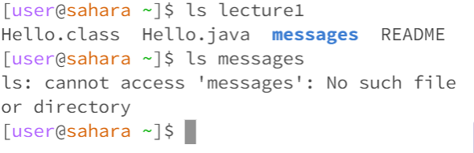

My week1 lab report
This week, we learned how to clone a new file in our GitHub account using the terminal. After we clone it, the file will appear on our page immediately, and we can use some basic methods to open it. 
The command cd is used to go with a path to a directory. However, using cd with no arguments will return to the beginning - with no directory or file. It will not change if we do not have a path to any directory or file. The first screenshot I provide is a sample of using the command cd without arguments. Because we did not tell the computer what to open, it just returned to no path.
/ 
For a simple directory, we need to know the file's name and type it after we type cd with a space. It will quickly appear on our title. The computer will follow what we tell it to do if it is a directory that could go further.

However, if we try to use it to open a file, it will return error and say that this is not a directory. An example screenshot is provided, named 3, in my repository. If there are no directories that can go farther, the computer will warn us.

Another command is ls, which is useful when we do not know or forget the directories, and it will show us all the files and directories that are available in the paths that we are now. It helps us to keep going on our way. Without arguments behind the ls command, it will list all the files and directories on our path.

If we add a path directory with the ls command, which is the directory that we can use cd to access, it will open the file list of that path instead of the path we are now. But if we cannot access by our current path, the computer will be warned for no access. That means that paths and directories are also important to the ls command. If the computer can access it, it could work. But if it cannot, it will return a error message of no access. 

Using the command with a path to a file as an argument will return the file's name. Because the computer could not find any directory, it just replaced the file name to show the programmer there was no way to go further.

cat command is to print the contents of one or more files given by the paths we use as an argument. However, without arguments, the computer will not know what to print, so it will return nothing, just like the picture I provided. 

If we use cat with a path to a directory as an argument, it will return a error with a line describing that it is a directory and could not print anything out. It means that cat command can only print contents in files. 

Using cat with a path to a file as an argument will return the things in the file. Not only can Txt files open, but also Java files or other different files. It can add more than one argument and print more content simultaneously. The computer will read the content and print out what it reads.

